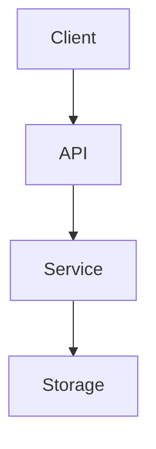

<!-- 
ARCHITECTURE TEMPLATE
=====================
Focus: Defining HOW the project is built.

AGENT EXECUTION PROTOCOL:
1. Identify services, databases, and communication paths.
2. Resolve [brackets].
3. Clean up instructional notes.
-->

# Architecture

**[Project Title / Name]** is structured as a **[e.g., microservices, monolithic, multi-agent]** system. It utilizes **[Service 1]** for **[Purpose]**, **[Database 1]** for **[Purpose]**, and **[Protocol]** for communication.

## High-Level Diagram

*Insert a Mermaid diagram or an image link here.*

## Architectural Style

**[MANDATORY]**
*Explain the design pattern (e.g., MVC, Service-Oriented, Hexagonal).*

| Layer | Responsibility |
|---|---|
| **[Layer Name]** | [Responsibility Description] |

## Component Responsibilities

### [Component 1 Name]
**[MANDATORY]**
*Explain what this specific part of the system does and its security/logic boundaries.*

### [Component 2 Name]
**[OPTIONAL]**
*Explain secondary components.*

## Runtime Object Lifetime

**[OPTIONAL]**
*Explain how state is managed, singletons, or process lifetimes.*

---

[Back to Documentation Index](README.md)

