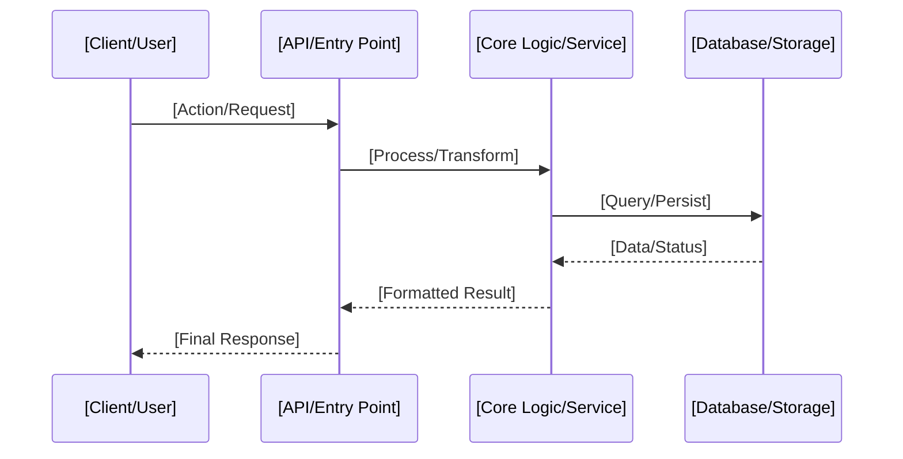

<!-- 
DATA FLOWS TEMPLATE (UNIVERSAL)
===============================
Focus: Visualizing and describing how data moves through any software system.

AGENT EXECUTION PROTOCOL:
1. Map the project's data journey from entry to persistence.
2. Resolve [brackets] with generic or specific service categories.
3. Clean up instructional notes.
-->

# Data Flows

This document details the critical data paths for **[Project Title / Name]**, illustrating how information is processed, stored, and monitored.

## 1. Primary Request/Response Flow
*Describe the end-to-end journey of a standard user request.*

## 2. Background / Async Processing Flow
*Describe how tasks are handled outside the main request cycle (e.g., workers, queues).*

## 3. Telemetry and Monitoring Flow
*Explain how system metrics (e.g., health, performance) are collected and exposed.*

## 4. Storage Architecture
*Define the roles of different storage layers (e.g., Relational, Key-Value, Object Storage).*

---

[Back to Documentation Index](README.md)

