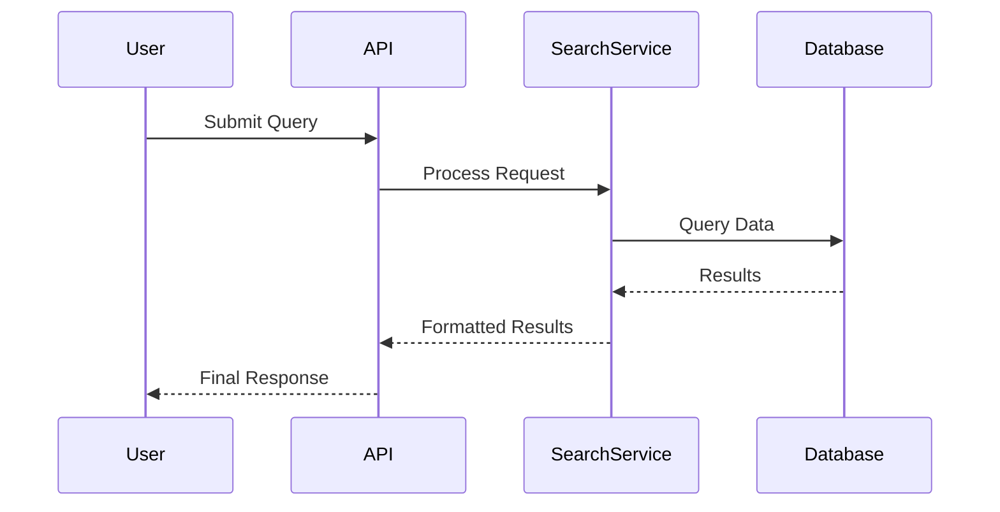

<!-- 
DATA FLOWS TEMPLATE
===================
Focus: Visualizing and describing how data moves through the system.

AGENT EXECUTION PROTOCOL:
1. Identify input, processing, and storage stages.
2. Resolve [brackets].
3. Clean up instructional notes.
-->

# Data Flows

This document details the critical data paths for **[Project Title / Name]**, covering search, indexing, metrics, and storage.

## 1. Search Flow
*Describe the path from a user query to the returned result.*

## 2. Indexing / Ingestion Flow
*Describe how new data is processed and stored in the system.*

## 3. Metrics and Monitoring Flow
*Describe how system metrics are collected and exposed (e.g., Prometheus).*

## 4. Storage Flow
*Describe where different types of data (logs, database, blobs) reside.*

---

[Back to Documentation Index](README.md)

