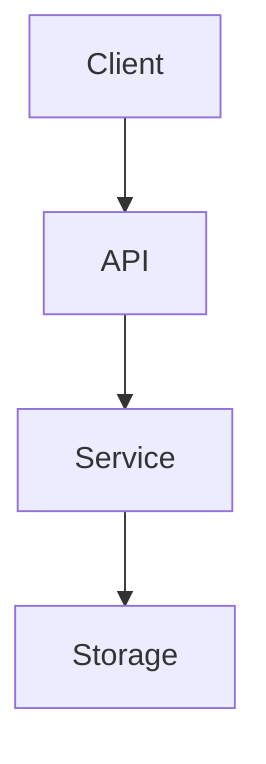

<!-- 
BẢN MẪU KIẾN TRÚC
=================
Trọng tâm: Xác định dự án được xây dựng NHƯ THẾ NÀO.

GIAO THỨC THỰC THI CHO AGENT:
1. Xác định các dịch vụ, cơ sở dữ liệu và đường truyền giao tiếp.
2. Giải quyết các thành phần trong dấu ngoặc vuông [ ].
3. Làm sạch các ghi chú hướng dẫn.
-->

# Kiến trúc hệ thống

**[Tên Dự án]** được cấu trúc theo hệ thống **[ví dụ: microservices, monolithic, đa agent]**. Dự án sử dụng **[Dịch vụ 1]** cho **[Mục đích]**, **[Cơ sở dữ liệu 1]** cho **[Mục đích]**, và **[Giao thức]** để giao tiếp.

## Sơ đồ cấp cao

*Chèn sơ đồ Mermaid hoặc liên kết ảnh tại đây.*

## Phong cách kiến trúc

**[BẮT BUỘC]**
*Giải thích mẫu thiết kế (ví dụ: MVC, Service-Oriented, Hexagonal).*

| Lớp | Trách nhiệm |
|---|---|
| **[Tên lớp]** | [Mô tả trách nhiệm] |

## Trách nhiệm của các thành phần

### [Tên thành phần 1]
**[BẮT BUỘC]**
*Giải thích phần cụ thể này của hệ thống làm gì và ranh giới bảo mật/logic của nó.*

### [Tên thành phần 2]
**[TÙY CHỌN]**
*Giải thích các thành phần phụ.*

## Vòng đời đối tượng thực thi (Runtime)

**[TÙY CHỌN]**
*Giải thích cách quản lý trạng thái, singletons hoặc vòng đời tiến trình.*

---

[Quay lại Danh mục Tài liệu](README.md)

