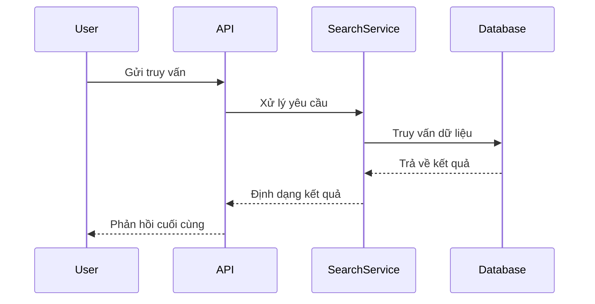

<!-- 
BẢN MẪU LUỒNG DỮ LIỆU
=====================
Trọng tâm: Trực quan hóa và mô tả cách dữ liệu di chuyển trong hệ thống.

GIAO THỨC THỰC THI CHO AGENT:
1. Xác định các giai đoạn đầu vào, xử lý và lưu trữ.
2. Điền dữ liệu vào dấu ngoặc vuông [ ].
3. Làm sạch các ghi chú hướng dẫn.
-->

# Luồng dữ liệu

Tài liệu này chi tiết các lộ trình dữ liệu quan trọng của **[Tên Dự án]**, bao gồm tìm kiếm, lập chỉ mục, số liệu và lưu trữ.

## 1. Luồng Tìm kiếm
*Mô tả lộ trình từ truy vấn của người dùng đến kết quả trả về.*

## 2. Luồng Lập chỉ mục / Nạp dữ liệu
*Mô tả cách dữ liệu mới được xử lý và lưu trữ vào hệ thống.*

## 3. Luồng Số liệu và Giám sát
*Mô tả cách các số liệu hệ thống được thu thập và hiển thị (ví dụ: Prometheus).*

## 4. Luồng Lưu trữ
*Mô tả nơi lưu trữ các loại dữ liệu khác nhau (logs, cơ sở dữ liệu, tệp tin).*

---

[Quay lại Danh mục Tài liệu](README.md)

