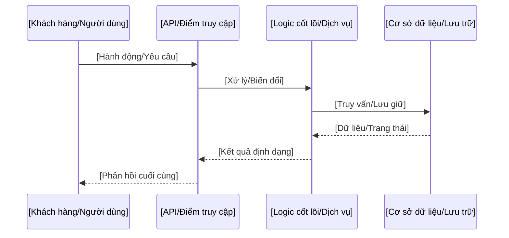

<!-- 
BẢN MẪU LUỒNG DỮ LIỆU (PHỔ QUÁT)
===============================
Trọng tâm: Trực quan hóa và mô tả cách dữ liệu di chuyển trong bất kỳ hệ thống phần mềm nào.

GIAO THỨC THỰC THI CHO AGENT:
1. Ánh xạ hành trình dữ liệu của dự án từ lúc bắt đầu đến khi lưu trữ.
2. Giải quyết các dấu ngoặc vuông [ ] bằng các danh mục dịch vụ chung hoặc cụ thể.
3. Làm sạch các ghi chú hướng dẫn.
-->

# Luồng dữ liệu

Tài liệu này chi tiết các lộ trình dữ liệu quan trọng của **[Tên Dự án]**, minh họa cách thông tin được xử lý, lưu trữ và giám sát.

## 1. Luồng Yêu cầu/Phản hồi Chính
*Mô tả hành trình từ đầu đến cuối của một yêu cầu tiêu chuẩn từ người dùng.*

## 2. Luồng Xử lý Nền / Bất đồng bộ
*Mô tả cách các tác vụ được xử lý bên ngoài chu trình yêu cầu chính (ví dụ: workers, hàng đợi).*

## 3. Luồng Đo lường và Giám sát
*Giải thích cách các số liệu hệ thống (ví dụ: sức khỏe, hiệu năng) được thu thập và hiển thị.*

## 4. Kiến trúc Lưu trữ
*Xác định vai trò của các lớp lưu trữ khác nhau (ví dụ: Quan hệ, Key-Value, Lưu trữ đối tượng).*

---

[Quay lại Danh mục Tài liệu](README.md)

